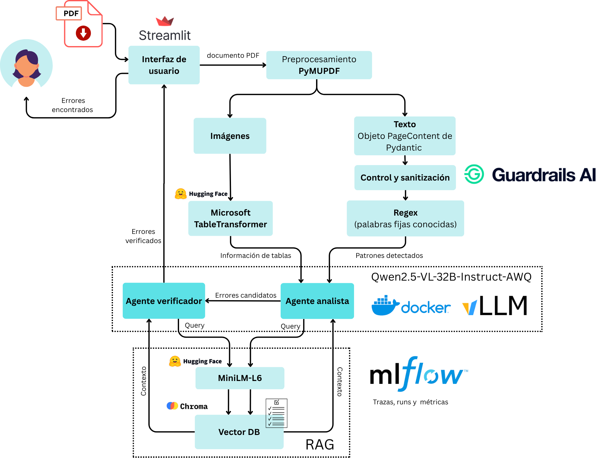

## Multi-Agent RAG PDF document review sistem (Spanish)

The project is a multi-agent pipeline with Retrieval-Augmented Generation (RAG) for automatically detecting errors in academic PDF documents.


## What is it?

This project implements a multi-agent workflow for PDF document review. Documents are processed and indexed, allowing specialized agents allowing specialized agents to perform analysis and validation tasks.

It supports OpenAI-compatible endpoints, including local servers such as vLLM and Ollama, as well as Groq.




## Requirements

- Python 3.11+
- Docker and Docker Compose (if using a local deployment)
- `uv` (recommended)
- Groq (optional) and Guardrails AI API keys 

## Installation

Clone the repository:

```bash
git clone https://github.com/arigarmendia/multiagent-rag-pdf-review.git
cd multiagent-rag-pdf-review
```

Install the Python dependencies:

```bash
uv sync
```

Start the required services (if running Ollama locally):

```bash
docker compose up -d
```

## Configuration

The project supports multiple LLM providers.

By default, it can be configured to use:
- Ollama running locally.
- Groq.
- A remote OpenAI-compatible endpoint (e.g., vLLM).

Configure the desired backend and any required API keys or endpoints before running the application.

## Running

Run the main application:

```bash
uv run streamlit run app/main.py
```
Or execute the appropriate entry point for the workflow you want to test, for example:

```bash
uv run pytest tests/test_pipeline.py
```


## Repository

```
agents/            # Multi-agent logic (analyst, verifier)
app/               # User interface
preprocessing/     # PDF parsing and structure extraction
pipeline/          # Core processing pipeline
rag/               # Indexing and retrieval logic
security/          # Guardrails validation
evaluation/        # Metrics and evaluation tools
data/              # PDFs, preprocessed data, ChromaDB, test data
tests/             # Unit and integration tests
docker-compose.yml # Optional Ollama LLM backend
```

## Contact
[✉️](arigarmendia@gmail.com) Ariadna Garmendia
